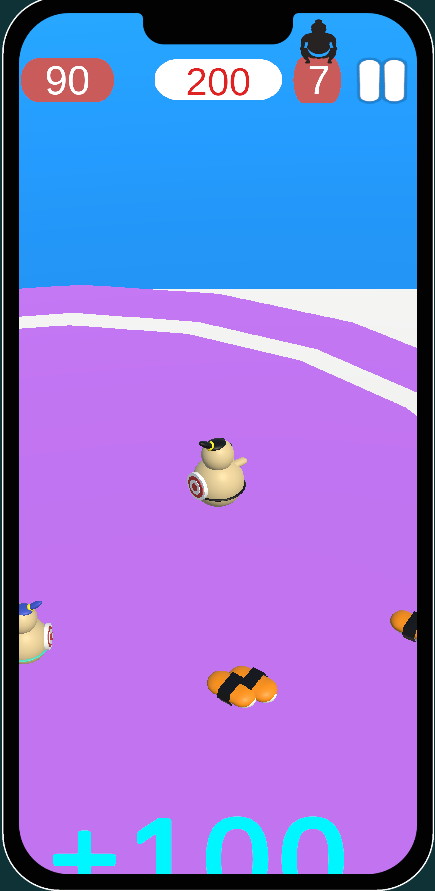

# Sumo.io-NoSurrender-Case

## Project Description

# PLAY

# VIDEO

https://github.com/MuhammetMelihKIR/Sumo.io-NoSurrender-Case/assets/120091310/afa1dddf-257e-4132-99b7-e0df59a00909

## Game Screen

 <a href="https://www.w3schools.com/cs/" target="_blank" rel="noreferrer"> 

