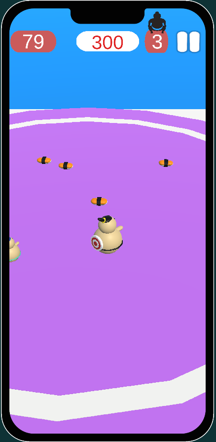
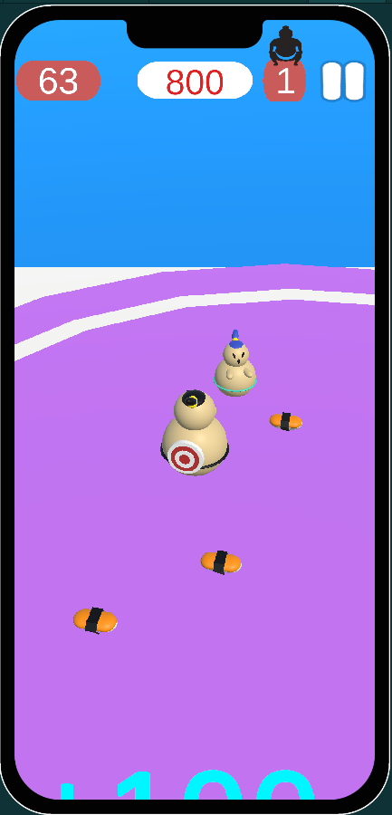

# Sumo.io-NoSurrender-Case
Oyunda kullanılan tasarımlar oyunun verdiği 3D objelerden (küp,silindir vs.) tasarlanmıştır.

# VIDEO
https://www.youtube.com/watch?v=qegDbBmZzEA

https://github.com/MuhammetMelihKIR/Sumo.io-NoSurrender-Case/assets/120091310/470a8ae2-6ed9-4f6e-8650-cf6e8beb27ec

## Game Screen

 <a href="https://www.w3schools.com/cs/" target="_blank" rel="noreferrer"> 

